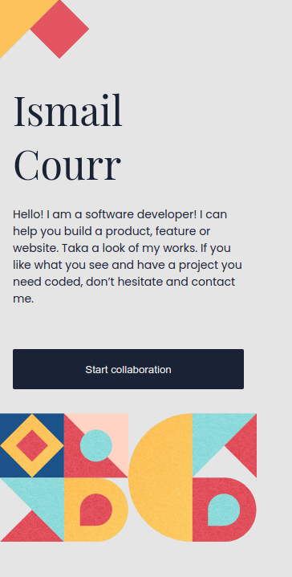

# Portfolio

> This is my portfolio created using HTML for the skeleton and CSS, FlexBox for the styling and positioning of the elements on the page. JavaScript to add some animation and functionality.

## Built With

- HTML
- CSS
- FlexBox
- Grid
- JavaScript
- Github Pages

## Live Demo

[Live Demo Link](https://ismailcourr.ml/)

## Getting Started

To get a local copy up and running follow these simple example steps.

- copy the repo URL
- $ git clone (repo URL)

## Author

- GitHub: [@ismailco](https://github.com/Ismailco)
- Twitter: [@ismailcourr](https://www.twitter.com/ismailcourr)
- LinkedIn: [ismailcourr](https://www.linkedin.com/in/ismailcourr/)
- My Website: [ismailcourr.ml](https://www.ismailcourr.ml)

## 🤝 Contributing

if you have any ideas to add to the project Please let me know

## Show your support

Give a ⭐️ if you like this project!
